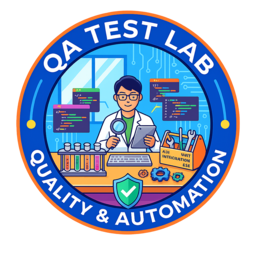

# 📊 Resumo dos Testes

Resultados consolidados dos testes executados pelos diferentes projetos e estratégias presentes neste laboratório.

# 🧪 QA Engineering Lab Monorepo

O **QA Engineering Lab** é um monorepo criado como um laboratório contínuo de experimentação em **Qualidade de Software**.

Mais do que um simples repositório de testes, este projeto é um ambiente de prática intencional, onde diferentes estratégias, níveis e abordagens de teste são explorados de forma estruturada e evolutiva.

Aqui são aplicados conceitos como:

- Testes unitários, de integração e ponta a ponta  
- Testes de APIs e interfaces  
- Testes não funcionais (performance, carga, resiliência)  
- Automação integrada a pipelines de CI/CD  
- Arquitetura e organização escalável de suítes de teste  

O laboratório está em constante expansão. Novas ferramentas, abordagens e experimentos podem ser adicionados a qualquer momento, tornando o projeto um ecossistema vivo de aprendizado, comparação e evolução técnica.

Este repositório existe para desafiar, validar hipóteses, testar limites e aprofundar o entendimento sobre engenharia de qualidade moderna.

---

## 📚 Links Úteis

> 📖 Acesse a documentação:  
> https://leohspaixao.github.io/qa-engineering-lab/

> 📊 Acesse o dashboard de resultados:  
> https://leohspaixao.github.io/qa-engineering-lab/dashboard/